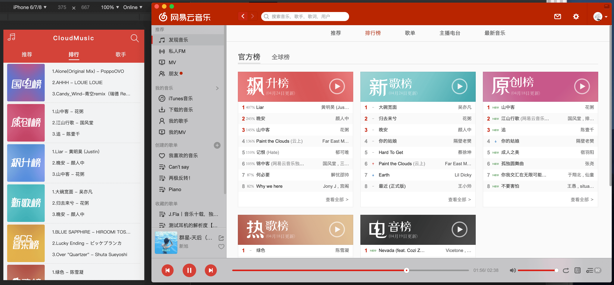
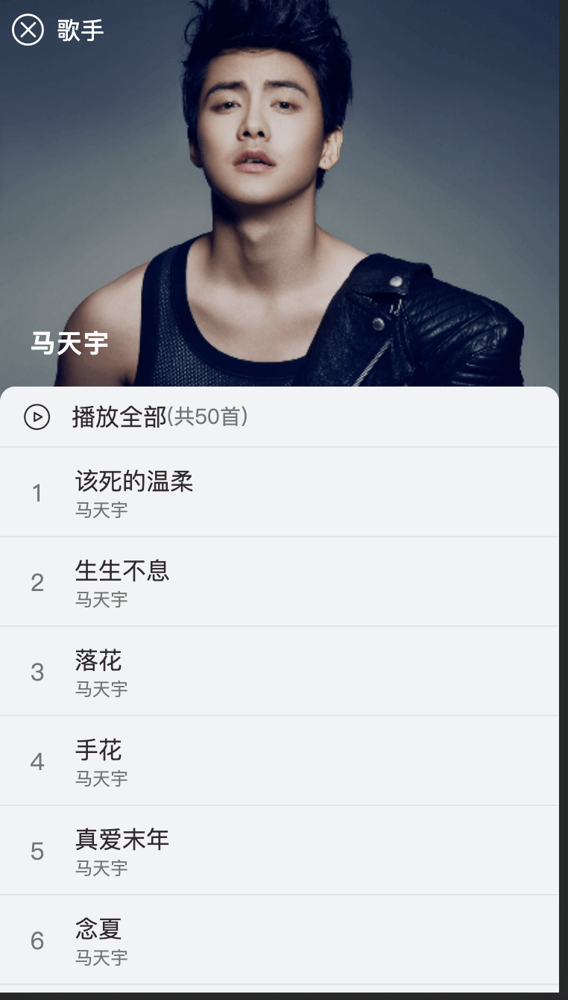

# ProjectName：cloudmusic

### 采用vue、vue-router、vuex、axios等vue全家桶进行开发，在项目中配置代理，请求本地node服务转发请求网易云线上数据。

### 开发使用最新vuecli3.0脚手架开发，数据为网易云真实数据，使用网上开源的node版本网易云音乐api抓去数据使用版本地址如下：https://github.com/TTiip/NeteaseCloudMusicApi.git

# 使用步奏
## 1.下载node版本安装依赖api运行
    推荐使用yarn安装依赖，之后node app.js启动后台服务
## 2.下载本项目 推荐使用yarn安装依赖
    运行 yarn 安装依赖
## 3.启动项目
    使用yarn serve 启动项目
## 4.在浏览器中输入对应地址即可
    地址为：http://localhost:8888 打开开发者手机调试模式效果更佳
####PS： 目前还未加上用户登陆功能，作为工作以来东拼西凑学的东西的一些检验：
    1.vue(vue全家桶当然不用说了)
    2.模块化(项目中使用我工作依赖所有学到的模块化知识，还有待提高！！！)
    3.代码规范(使用eslint作为检验代码标准、结尾不用分号！！！使用单引号！！！)
    4.命名规范(之前写action、mutation都是直接在文件编写，这次使用文件命名常量统一导入导出)
    5.axios封装(这个暂时还没做，因为没有涉及到登陆，请求中也没有携带token等参数，所以没有配置axios拦截器，对axios进行📦，后期有时间会补上)
    6.有封装请求地址，将代码展示和数据分开，请求统一封装在api文件夹下的文件统一导入导出，避免接口修改改动页面文件
    7.这次开发没有使用async await语法 一直使用的Promise的链式操作，使用es6、es7语法开发
    8.对自己的阶段性检测，仍需努力。。。
 **前端**
 
 * `Vue`：用于构建用户界面的 MVVM 框架
 * `vue-router`：为单页面应用提供的路由系统，使用了 `Lazy Loading Routes` 技术来实现异步加载优化性能
 * `vuex`：Vue 集中状态管理，在多个组件共享某些状态时非常便捷
 * `vue-lazyload`：实现图片懒加载，节省用户流量，优化页面加载速度
 * `better-scroll`：解决移动端各种滚动场景需求的插件，使移动端滑动体验更加流畅
 * `SCSS`：css 预编译处理器
 * `ES6`：ECMAScript 新一代语法，模块化、解构赋值、Promise、Class 等方法非常好用
 
 # 以下为一些预览图
 ## 推荐首页
 
 ## 排行版
 
 ## 歌手详情
 
